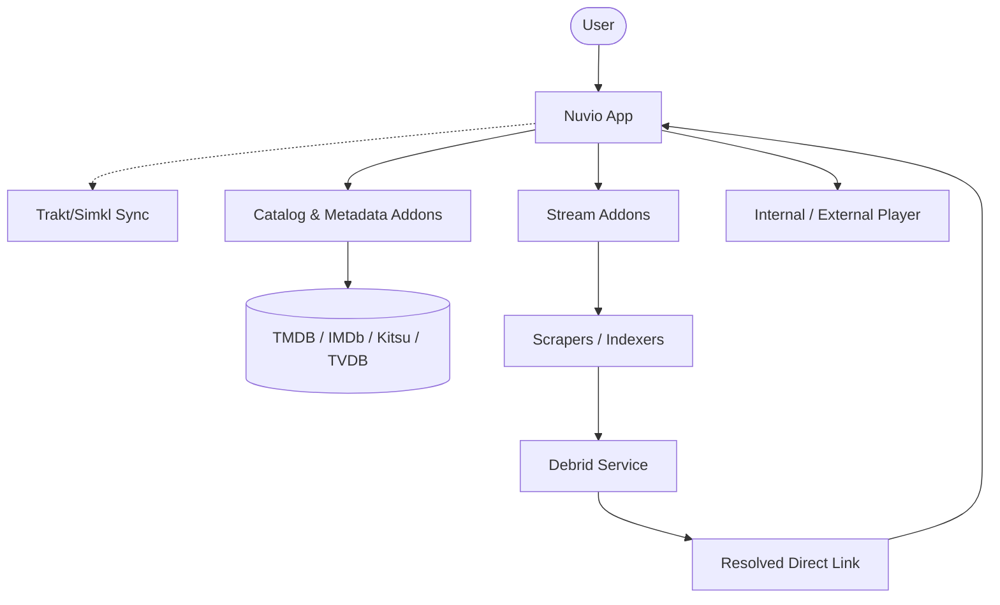

[🏠 Home](../../README.md) | [⚡ Quick Start](quick-start.md) | [📢 Report Issue](../../issues)

---

# 📖 General Overview

Nuvio is a powerful media aggregator designed to provide a unified interface for various content sources. It allows users to browse and play media from multiple providers through a highly customizable and modern UI.

> [!TIP]
> Just want to get started? Check out the [Quick Start Guide](quick-start.md).

## Visual Architecture

## How It Works

Nuvio operates on a modular architecture using **Addons**. By itself, Nuvio is a "clean" player with no built-in content.

1.  **The App:** The shell that provides the UI, player, and management tools.
2.  **Addons:** External modules that "hook" into Nuvio to provide content catalogs (Movies, TV Shows, Anime).
3.  **Indexing:** Nuvio indexes metadata from your enabled addons to create a searchable database.

## Key Features

- **Cross-Platform:** Available on Android (Mobile & TV) and iOS.
- **Unified Search:** Search across all installed addons simultaneously.
- **Profiles:** Add profiles to keep everything seperate
- **Intro/Outro Skip:** Uses introDB to skip intros and outros
- **Auto Source Select:** Automatically plays a file based on your settings. No input needed.
- **Trakt Integration:** Sync your watch history and lists.
- **Customizable UI:** Themes and layout options to suit your device.
