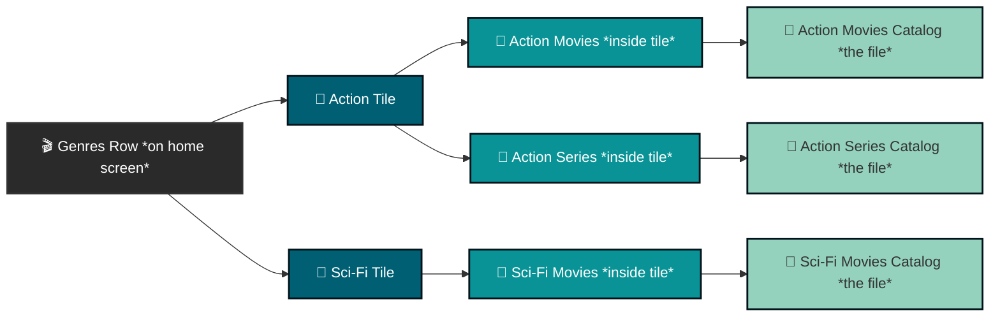

[Home](../../README.md) | [Quick Start](../../docs/quick-start.md) | [Overview](../../docs/overview.md) | [Features](../../docs/features.md) | [Installation](../../docs/installation/README.md) | [Settings](../../docs/settings/README.md) | [Troubleshooting](../../docs/troubleshooting.md) | [FAQ](../../docs/faq.md)

---

## Nuvio Collections

> [!CAUTION]
> Creating collections should be considered an advanced user feature (seriously, this is a warning). If you don't consider yourself an advanced user, it's recommended to copy one from [Nuvio's community collections](https://nuvio.tv/community-collections) instead.

### Contents

- [Understanding Collection Structure](#understanding-collection-structure)
- [Before You Start](#before-you-start)
- [Creating Your First Collection](#creating-your-first-collection)
- [The Folders Tab](#the-folders-tab)
  - [Add Catalog](#add-catalog)
  - [Add TMDB](#add-tmdb)
  - [Add Trakt](#add-trakt)

### Understanding Collection Structure

Nuvio collections can be confusing, but at their core they're just a file system: folders containing subfolders, which contain files (catalogs). The diagram below illustrates this relationship.

### Before You Start

You'll need two things to create a collection:

1. **A metadata addon with your catalogs** already set up, containing the catalogs you want included. This guide assumes that's done.
2. **Images or GIFs for your collection covers**, sourced from the internet or from [Nuvio's community covers](https://nuvio.tv/covers).
   - If you're not using a community cover, the URL must point directly to the image or GIF file itself — not to a webpage that displays it:
     - ❌ Incorrect: `https://github.com/rrevanth/nuvio-assets/blob/main/popular/new/new-poster.png`
     - ✅ Correct: `https://raw.githubusercontent.com/rrevanth/nuvio-assets/refs/heads/main/popular/new/new-poster.png`
   - You're also welcome to upload your own images or GIFs to Nuvio's community collections for others to use.

### Creating Your First Collection

You can create a collection either in the app or on the Nuvio website — the website is recommended.

1. Once logged in, make sure you're on the **Account** tab.
2. In the left sidebar, select **Collections**.
3. Select **Create Collection**.
4. You'll be prompted to choose a starting template — select **Continue** to skip this for now.
5. Configure the collection's general settings:
   - **Collection ID**: leave this as is.
   - **Title**: the name shown for the collection.
   - **View Mode**: choose one of three layouts:
     - **Tabbed Grid**: each subfolder appears as its own tab, displayed in a grid. For example, an Action catalog containing "Action Movies 2020" and "Action Movies 2010" subfolders would show each as a separate tab.
     - **Rows**: each subfolder appears as its own row, all under a single tab. Using the same example, "Action Movies 2020" and "Action Movies 2010" would appear as separate rows under one tab.
     - **Follow Layout**: follows whatever layout is set in the Nuvio app.
   - **Backdrop Image or GIF URL**: the image URL described in [Before You Start](#before-you-start).
   - **Show All Tab**: adds an extra tab that combines all the subfolders in this collection.
   - **Pin to Top**: moves the collection ahead of others.
   - **Enable Focus Glow**: adds a highlight effect when hovering over the collection.
6. Switch to the **Folders** tab to configure the collection's content — covered in detail below.

### The Folders Tab

The Folders tab is where you define the subfolders ("blocks") that make up your collection:

- **Outline** (left sidebar): add one entry per block you want shown on your home screen. For example, a "Franchises" collection might have separate entries for The Matrix, The Lord of the Rings, and Star Wars.
- **Folder ID**: keep this as is.
- **Folder Title**: the name shown for this folder's tab or row. For example, in an "Action" collection, folders might be titled "Action Movies 2020" and "Action Movies 2010".
- **TileShape**: choose **Landscape**, **Square**, or **Portrait**.
- **Sources**: populate the folder using **Add Catalog**, **Add TMDB**, or **Add Trakt**, described below.

#### Add Catalog

Choose the addon that contains the catalog you want (e.g., AIOMetadata), then select the specific catalog you created with that addon.

#### Add TMDB

TMDB sources are configured across three groups of settings.

**General settings** *(common to all TMDB sources)*

These settings define the basic presentation and ordering of your collection within Nuvio.

- **Type**: the media format for the list — either **Movie** or **Series**.
- **Name**: the custom title for this collection, shown exactly as entered (e.g., "Top Sci-Fi" or "My Watchlist").
- **Sort By**:
  - **Original**: the order set by the database or list creator.
  - **Recent**: sorted by release date.
  - **Top Rated**: ranked by review score or rating count.

**ID-based sources**

Most sources need a specific identifier to pull the right metadata from the respective database.

- **Sources**: TMDB List, Trakt List, TMDB Keyword, TMDB Company, TMDB Collection.
- **ID Field**: a numerical or alphanumeric code, found in the URL of the relevant list, collection, company, or keyword on TMDB or Trakt. For example, in `themoviedb.org/collection/1248`, the ID is `1248`.

**Unique sources**

A couple of sources use different input fields instead of a standard ID:

- **TMDB Discover**: instead of an ID, select one or more genres (e.g., Action, Horror, Science Fiction) from a dropdown. This dynamically builds a collection of media matching those categories from TMDB's database.
- **Letterboxd List**: paste the full URL of the Letterboxd list you want to import. Use the exact link from your browser rather than searching for a separate ID.

#### Add Trakt

Trakt sources are configured across two groups of settings.

**Core settings** *(always required)*

Whenever you create a new Trakt-sourced collection, configure these base options first:

- **Type**: the media format for the row — either **Movie** or **Series**.
- **Name**: the custom label for this collection, shown on your Nuvio home screen (e.g., "My Trakt Watchlist" or "Trending Shows").
- **Sort By**:
  - **Default**: Trakt's native order.
  - **Title (asc/desc)**: alphabetical.
  - **Primary Release Date (asc/desc)**: chronological, by release year.

**Source-specific settings**

After choosing your Trakt source type from the dropdown, configure its unique fields:

- **Trakt List**: pulls a specific, static list created by you or another Trakt user.
  - **URL**: the full web address of the target Trakt list.

> [!CAUTION]
> **URL formatting matters.** The link must use the standard desktop domain format — Nuvio cannot read mobile or app-generated links.
>
> - ✅ Correct: `https://trakt.tv/users/...`
> - ❌ Incorrect: `https://app.trakt.tv/...`
>
> Using an `app.trakt.tv` link will cause the collection to fail syncing and remain empty.
